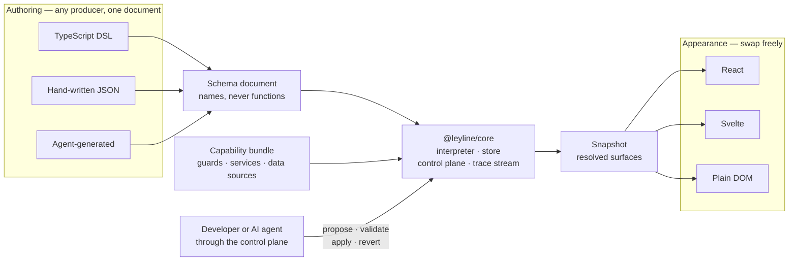

# Leyline

**Workflow knowledge belongs outside the UI.**

Application UIs accumulate knowledge that does not belong to them: which API
must finish before the next one starts, which action exists only on a paid tier,
which of three destinations a completed step leads to, which panels a screen
composes. Because that knowledge lives inside components, restyling, migrating
frameworks, or hiding a capability for some users each turn into a risky
refactor instead of a configuration change.

Leyline extracts that knowledge into a portable, declarative, framework-agnostic
layer — a serializable document describing nodes, guarded transitions, and
semantic UI intent — and leaves frameworks responsible for appearance and
interaction alone. The same document drives a React application and a SvelteKit
one. Swapping the renderer registry restyles everything without touching the
workflow.

The layer is operable by AI agents through the same control plane developers
use, with the schema held inert as a verified security boundary: an agent may
reference a guard, and may never introduce one.

> _Leyline_: the invisible lines said to connect significant places into a
> network. Nodes joined by lines, the lines themselves never rendered, the
> topology present whatever gets built on top.

## Status

**v1 feature-complete; not yet published to npm.** All seven delivery stages have
landed: the schema, the headless runtime with its control plane and trace stream,
three adapters (React, Svelte, plain DOM), the agent interface over MCP, and the
TypeScript DSL. The seven security invariants each carry an adversarial suite
that runs as a required gate.

Publishing is wired and waiting on the button: merging the changesets on `main`
opens a version pull request, and merging that one publishes `@leyline/*` to npm
at 1.0.0 — [`docs/releasing.md`](docs/releasing.md) covers the one-time npm
setup and how to use the packages from another project before then.

See [`docs/roadmap.md`](docs/roadmap.md) for what is done and what follows v1 —
a devtools inspector, an OpenTelemetry sink, and the Kotlin authoring track.

## How it fits together



Sequencing, eligibility, and navigation live in the document. Appearance lives in
a renderer registry. Both stay reachable through one control plane, which is what
lets a developer and an agent operate the layer with identical power and
identical safety checks.

See [`docs/architecture.md`](docs/architecture.md) for the mechanisms in detail.

## Packages

| Package                                | Responsibility                                                                                            | Framework deps |
| -------------------------------------- | --------------------------------------------------------------------------------------------------------- | -------------- |
| [`@leyline/schema`](packages/schema)   | Zod definitions, validators, JSON Schema export, version rules, change-description schemas                | none           |
| [`@leyline/core`](packages/core)       | Interpreter, store, capability binding, registries, control plane, change log, policy hooks, trace stream | none           |
| [`@leyline/dsl`](packages/dsl)         | TypeScript builder emitting validated schema documents                                                    | none           |
| [`@leyline/agent`](packages/agent)     | Introspection, operation descriptors, MCP server adapter                                                  | none           |
| [`@leyline/react`](packages/react)     | React reactivity bridge, `WorkflowView`, registry helpers                                                 | React          |
| [`@leyline/svelte`](packages/svelte)   | Svelte store bridge and component                                                                         | Svelte         |
| [`@leyline/vanilla`](packages/vanilla) | Direct DOM adapter; reference implementation for plain JS                                                 | none           |

`@leyline/devtools` and `@leyline/otel` follow after v1.

## What it looks like

A workflow is data, not code:

```jsonc
{
  "leylineVersion": "1.0.0",
  "id": "workspace-onboarding",
  "name": "Workspace onboarding",
  "entry": "create-workspace",
  "requires": {
    "guards": ["isPaidTier"],
    "services": ["createWorkspace"],
    "dataSources": ["workspaceActions", "workspaceMetrics"],
  },
  "nodes": [
    { "id": "create-workspace", "kind": "step", "invoke": "createWorkspace" },
    {
      "id": "workspace-hub",
      "kind": "hub",
      "surfaces": [
        { "id": "actions", "type": "datatable", "dataSource": "workspaceActions" },
        { "id": "metrics", "type": "metric-panel", "dataSource": "workspaceMetrics" },
      ],
    },
  ],
}
```

Guards, services, and data sources appear as names. Implementations bind
separately, which keeps the document serializable, keeps the logic testable on
its own, and keeps an agent-authored document unable to smuggle in code.

Write it by hand, or through the [DSL](packages/dsl) — which emits the same
bytes, and catches a mistyped transition target at compile time. The
[authoring guide](docs/guides/authoring.md) covers both.

## Documentation

**Guides**

- [Authoring](docs/guides/authoring.md) — writing a workflow: what belongs in the
  document, what belongs in the capability bundle, and what belongs in neither
- [Agent integration](docs/guides/agents.md) — exposing the control plane to an
  agent, and bounding what it can do
- [Migration](docs/guides/migration.md) — adopting Leyline into an application
  that already exists, and moving documents across schema versions

**Reference**

- [Glossary](docs/glossary.md) — every term in one place, with the distinctions
  that trip people up: guard vs policy, change vs change record, context vs
  snapshot
- [Architecture](docs/architecture.md) — diagrams of the package graph, runtime
  path, renderer resolution, control plane, and trace stream
- [Project brief](docs/project-brief.md) — the grounding document: problem,
  goals, non-goals, and the fifteen settled architectural decisions
- [Constitution](docs/constitution.md) — the obligations every change answers to
- [Roadmap](docs/roadmap.md) — the delivery sequence and its exit criteria
- [Decisions](docs/decisions/) — AD1–AD15 and everything recorded since
- [Open questions](docs/open-questions.md) — all eight, and what settled each
- [Versioning](docs/versioning.md) — document versions and package versions
- [Performance](docs/performance.md) — what tracing costs when nobody reads it
- [Security](SECURITY.md) — threat model and the seven invariants
- [Examples](examples) — the same scenario in React, Svelte, plain DOM, and
  driven by an agent
- [Contributing](CONTRIBUTING.md) — setup, commands, and the merge gates

## See it running

[`examples/`](examples) holds the scenario above four times over. Three of them
render **the same document** through the same control plane, sharing everything
except the part that is genuinely about their framework — which is the point.

```bash
pnpm --filter @leyline-examples/react-workspace dev     # React
pnpm --filter @leyline-examples/svelte-workspace dev    # Svelte
pnpm --filter @leyline-examples/vanilla-workspace dev   # no framework at all
```

The fourth needs no browser. [`agent-cli`](examples/agent-cli) drives the same
workflow through `@leyline/agent` — scripted, interactive, or by a real model:

```bash
pnpm --filter @leyline-examples/agent-cli demo   # no API key, no network
pnpm --filter @leyline-examples/agent-cli repl   # type tool calls yourself
pnpm --filter @leyline-examples/agent-cli chat   # needs ANTHROPIC_API_KEY
```

The scripted run is what CI runs. Two of its steps are refusals — one from the
renderer catalogue, one from the deployment's policy — and they are the
interesting ones.

## Development

```bash
corepack enable
pnpm install
pnpm verify
```

## License

Apache-2.0. See [LICENSE](LICENSE).
