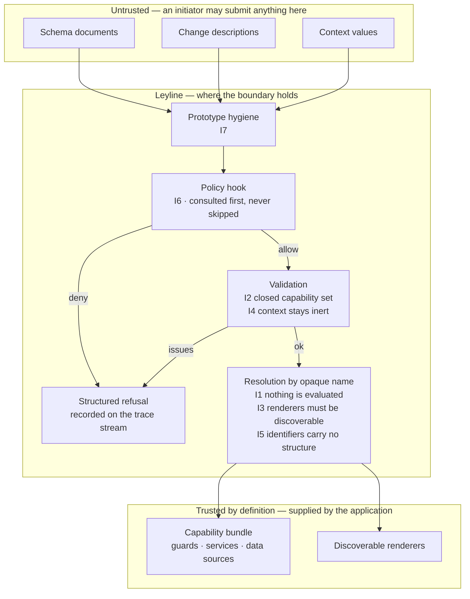

# Security

## Reporting a vulnerability

Report privately through GitHub's security advisory form on this repository
rather than opening a public issue. Expect an acknowledgement within a few
working days.

## Threat model

The vocabulary this section uses — **inert**, **opaque**, **discoverable**,
**capability bundle**, **initiator**, **trusted by definition** — is defined in
[`docs/glossary.md`](docs/glossary.md#the-security-boundary).

Leyline exists so that an AI agent can reshape a running application's workflow
and presentation through a structured interface. That capability defines the
threat.

**The party defended against.** An initiator — typically an AI agent, possibly a
compromised one, possibly one following instructions injected into content it
read — who can submit arbitrary schema documents and arbitrary change
descriptions to the control plane.

**What that party must never gain.** Execution of code they supplied, or data
access beyond what the capability bundle already grants to the application
itself. An agent may reference a guard; it may never introduce one. An agent may
swap a renderer the application already made discoverable; it may never supply a
component.

**Trusted by definition, and therefore out of scope:**

- The capability bundle the application supplies. A malicious guard or service
  in that bundle sits inside the trust boundary; Leyline cannot and does not
  defend against it.
- Renderers the application registers as discoverable. Making a renderer
  discoverable is the application's decision to trust it.
- The transport carrying MCP traffic, and whatever authenticates it. Initiator
  labels reach Leyline self-asserted and advisory; **attestation** is the
  separate, non-forgeable fact about the connection, supplied by the host at
  construction rather than by the caller
  ([decision 0031](docs/decisions/0031-initiator-trust.md)). The policy hook is
  the documented place to enforce anything stronger.
- The host application's own bugs, its network, and its browser.

## The boundary, drawn

An initiator crossing that boundary gains exactly what the application already
granted itself and nothing more. The arrows into the trusted set carry names,
never code.

## Invariants

Each invariant carries a test suite that attempts to violate it. Those suites
gate merges: a change to the schema or the control plane arriving without a
corresponding adversarial test does not merge.

### I1 — No executable content in schema or change documents

Parsing and validating a document has no side effects. No field reaches `eval`,
`new Function`, a dynamic `import`, or an expression interpreter. Guards,
services, data sources, and renderers are referenced only by opaque string
identifiers resolved against registries the initiator does not control.

_Enforced by:_ lint rules banning `eval` and `new Function` across the
workspace; adversarial tests submitting documents whose fields carry code-shaped
strings and asserting that nothing evaluates.

_Suites:_ `packages/core/src/control/invariants.test.ts`,
`packages/schema/src/changes.test.ts`, `packages/schema/src/workflow.test.ts`

### I2 — Closed capability set

A document may reference only capability names the bound bundle already supplies.
It cannot introduce a guard, service, or data source. Binding rejects unknown
names rather than ignoring them, and reports every one of them at once.

_Enforced by:_ `CapabilityBindingError` at binding time; adversarial tests
binding documents that name capabilities the bundle lacks. The DSL checks the
same set at compile time, so an authoring mistake is a type error before it is
ever a runtime one.

_Suites:_ `packages/core/src/control/control.test.ts`,
`packages/core/src/control/invariants.test.ts`, `packages/core/src/workflow.test.ts`,
`packages/dsl/src/types.test.ts`, `packages/schema/src/changes.test.ts`,
`packages/schema/src/validate.test.ts`

### I3 — Renderer registration is capability-gated

A change registering a renderer may name only a renderer the application already
made discoverable. An initiator cannot supply component code through the control
plane.

What makes a renderer discoverable is its **catalogue** entry — a name, a
description, and the surface types or region kinds it is willing to claim
([decision 0023](docs/decisions/0023-renderer-catalogue.md)). Publishing that
entry is the application's decision to trust the renderer, and it is the only
way a name becomes addressable at all. An agent reads the catalogue to learn
what it may name; it has no path from a catalogue entry back to a component.

_Suites:_ `packages/agent/src/mcp.test.ts`,
`packages/core/src/control/control.test.ts`,
`packages/core/src/control/invariants.test.ts`, `packages/core/src/registry.test.ts`,
`packages/schema/src/changes.test.ts`

### I4 — Context is data, not a channel

Values an initiator writes into context through change descriptions get
validated against the workflow's declared context shape and stay inert. Nothing
in the core, the adapters, or the agent package interprets a context value as an
identifier, a path, a URL, or code.

_Suites:_ `packages/core/src/control/invariants.test.ts`,
`packages/schema/src/changes.test.ts`

### I5 — Identifiers are opaque

Stable identifiers carry no path, URL, or structural meaning exploitable by
construction. Content-derived identifiers use a hash, not a concatenation, and
length-prefix their inputs so no arrangement of delimiters inside one part can
imitate a different set of parts.

_Enforced by:_ `@leyline/schema/src/ids.ts` and its adversarial tests. The rule
also ships as a `pattern` in the exported JSON Schema, so a producer that never
runs this TypeScript is held to it too.

_Suites:_ `packages/core/src/control/invariants.test.ts`,
`packages/schema/src/changes.test.ts`, `packages/schema/src/ids.test.ts`,
`packages/schema/src/json-schema.test.ts`

### I6 — Policy is consulted first and cannot be bypassed

Every proposal reaches the policy hook before validation, apply, or revert. No
control-plane operation skips it — not revert, not hydration of persisted
changes, and not operations initiated by application code. There is no
privileged initiator. In production mode with no policy configured, an agent
initiator gets denied.

`apply` and `validate` take only a proposal **identifier**. Everything acted on
comes from what was recorded at propose time, so a caller cannot validate one
change and commit another under the same id.

_Suites:_ `packages/core/src/control/control.test.ts`,
`packages/core/src/control/invariants.test.ts`

### I7 — Prototype and injection hygiene

Documents parse with prototype-pollution defenses. Keys such as `__proto__`,
`constructor`, and `prototype` get rejected at validation and dropped during
parsing, at any depth. Renderer predicates receive frozen surface descriptors.

_Enforced by:_ `@leyline/schema/src/hygiene.ts` and its adversarial tests.
Hygiene runs before any other finding is reported, so a hostile document is
refused for being hostile rather than for being malformed.

_Suites:_ `packages/core/src/control/invariants.test.ts`,
`packages/schema/src/hygiene.test.ts`, `packages/schema/src/validate.test.ts`

## Status

**All seven ship, and all seven are gated.** Every invariant above carries at
least one suite that tries to break it, and the `Security invariants` job in
[`.github/workflows/ci.yml`](.github/workflows/ci.yml) runs them as a required
check across every package that holds one.

The `_Suites:_` lines are not a hand-maintained list. `tests/security.test.ts`
reads this file and the test sources together and fails if they disagree in
either direction — a suite this document does not mention, or a file this
document names that carries no such test. It also fails if the CI job's project
filter stops covering a package that holds an invariant suite, which is how a
gate goes quiet without anyone noticing.

A change to the schema or the control plane that arrives without a corresponding
adversarial test does not merge (AD14, brief §8). Where the shipped suites and
this document disagree, the suites are the defect.
