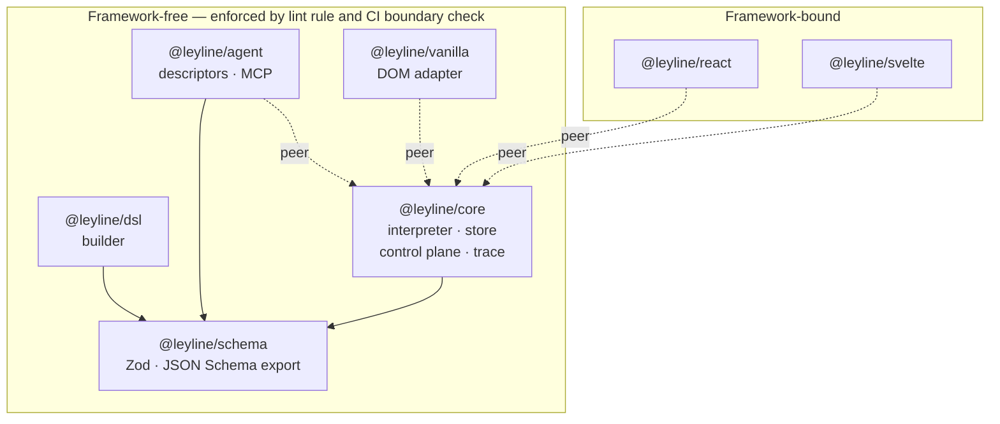
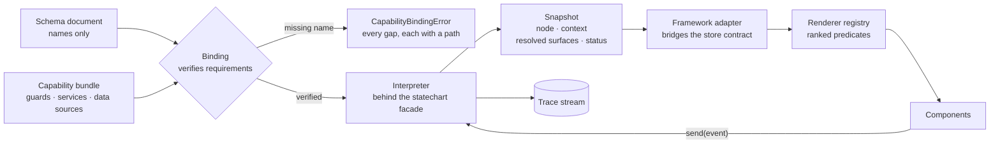
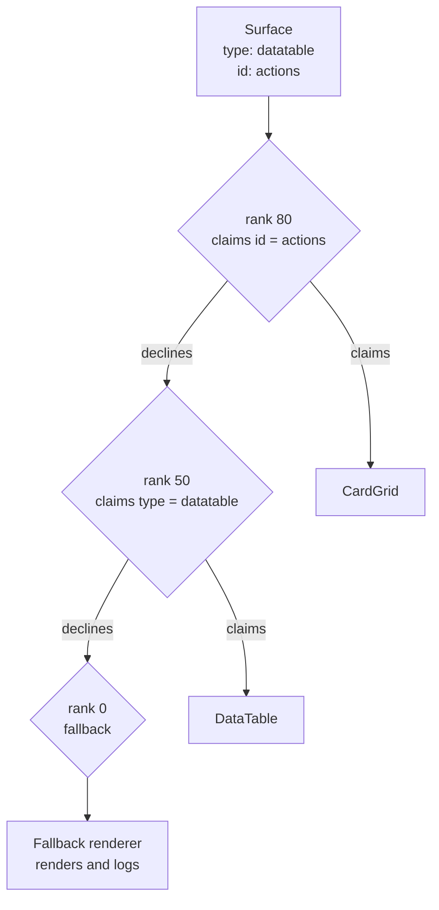
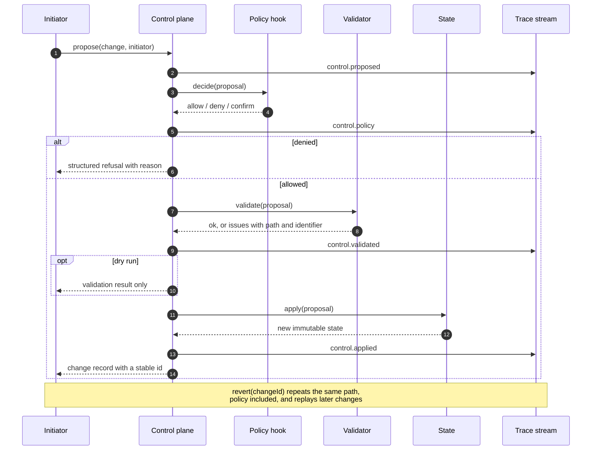
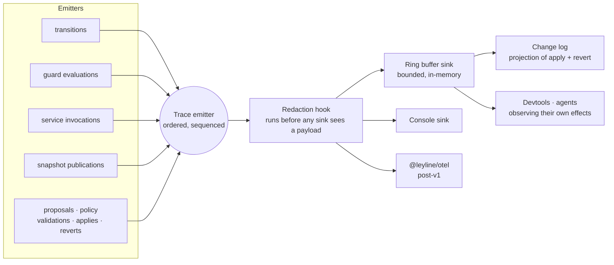
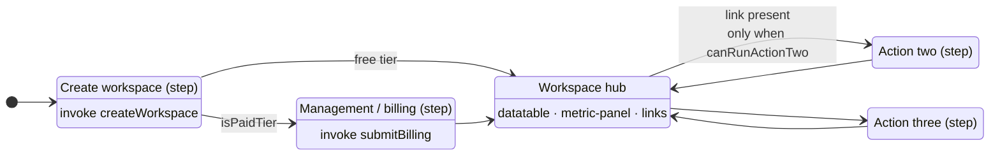

# Architecture

Diagrams for the shape the brief describes. Each one covers a mechanism that
prose alone leaves ambiguous; the reasoning behind every choice lives in
[`project-brief.md`](project-brief.md) §5, and the obligations they create live
in [`constitution.md`](constitution.md).

## Packages and dependency direction

Arrows point from a package to what it depends on. The framework-free set is a
CI gate, not an aspiration: `scripts/check-boundaries.mjs` walks manifests
transitively and an ESLint rule guards imports.

Only `@leyline/core` may name the statechart engine, and only inside
`src/engine/` (AD3). Everything else in the core depends on the facade
interface, which keeps the option of replacing XState with a smaller purpose-built
interpreter later.

## What a document becomes at runtime

A schema document carries names, never functions (AD2). Binding is where names
meet implementations, and where a mismatch surfaces — at registration time, with
every gap reported at once, rather than at click time (G8).

Two properties of that path carry weight:

- Guards are already evaluated and data sources already attached by the time a
  surface reaches a renderer (AD6). A renderer holds no conditional workflow
  logic; it receives a ready-to-render list.
- An unresolvable surface renders a registered fallback and logs. It never
  throws, which is what lets a deployed application read a document written
  against a later minor version (AD8).

## Ranked renderer resolution

A flat type map cannot express "this specific table looks different". Ranked
predicates can, and the highest-ranked claim wins (AD5).

An agent swapping the actions table for a card grid registers a renderer at a
higher rank. Nothing about the workflow document changes, and reverting removes
the registry entry.

## The control plane: propose, validate, apply, revert

One mutation path serves application code, a developer at a REPL, devtools, and
an agent alike (AD10). Policy runs first and nothing skips it — not revert, not
application code (I6).

Every proposal, its policy decision, its validation, and its apply share one
correlation ID, so the causal chain reconstructs from the stream alone.

## One stream, two readers

Everything observable flows through a single emitter (AD15). The change log
projects from that stream rather than living beside it, so the audit trail and
the observability data cannot disagree.

With no sink attached, emission costs a guard check and allocates nothing. Events
stay small — an envelope plus identifiers, a few hundred bytes as the working
ceiling. Anything larger goes through the control plane instead.

## The motivating scenario as a graph

Brief §2 is the acceptance benchmark: a design that cannot express this cleanly
has failed. Guards appear on transitions and on surface presence alike (G7).

The hub's surfaces carry their own guards, so the _Action Two_ link appears and
disappears as context changes, with no page reconstruction. The agent extension
of the scenario — swapping the actions table for a card grid, and hiding the
metrics panel for free-tier workspaces — reaches the same graph through the
control plane, changing a registry entry in the first case and attaching a guard
to a surface in the second.
