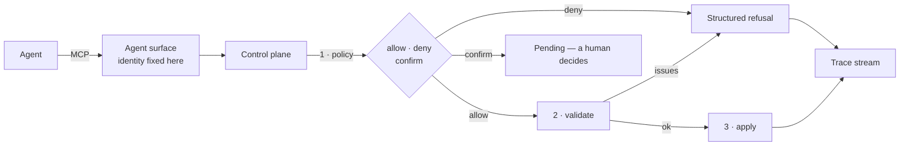

# Agent integration guide

How to let an AI agent operate a Leyline application — and, more importantly,
how to bound what it can do.

Terms are defined in the [glossary](../glossary.md):
[control plane](../glossary.md#propose-validate-apply-revert),
[proposal](../glossary.md#proposal), [policy](../glossary.md#policy),
[initiator](../glossary.md#initiator),
[attestation](../glossary.md#attestation),
[agent surface](../glossary.md#agent-surface).

## The premise

An agent gets the control plane a developer gets. Not a parallel API, not a
restricted mirror — the same one, with the same checks. `@khorum-oss/leyline-agent` adds no
capability the control plane lacks (G9); what it adds is packaging: introspection
that reads like documentation, operation descriptors carrying the published JSON
Schema, and the identity boundary.

The safety does not come from giving the agent less. It comes from the schema
being inert: there is nothing in the document that can be code, so the worst a
hostile initiator can do is name things the application already trusts.



Policy comes first, always — before validation, before apply, and before revert.
There is no operation that skips it and no privileged initiator (I6).

## Standing up a surface

```ts
import { createAgentSurface } from '@khorum-oss/leyline-agent';

const surface = createAgentSurface(workflow, {
  initiator: { kind: 'agent', label: 'card-grid-swap' },
});
```

That is the whole setup. The surface speaks for exactly one identity, fixed here,
and no operation on it accepts an initiator. A caller cannot say who it is,
because whoever accepted the connection already decided.

### Over MCP

```ts
import { Server } from '@modelcontextprotocol/sdk/server/index.js';
import { ListToolsRequestSchema, CallToolRequestSchema } from '@modelcontextprotocol/sdk/types.js';
import { serveOverMcp } from '@khorum-oss/leyline-agent/mcp';

const server = new Server({ name: 'leyline', version: '1' }, { capabilities: { tools: {} } });

serveOverMcp(server, surface, {
  listToolsRequestSchema: ListToolsRequestSchema,
  callToolRequestSchema: CallToolRequestSchema,
});
```

The request schemas arrive as arguments rather than imports, which is why
`@khorum-oss/leyline-agent` has no dependency on the MCP SDK at all. Transport and
authentication stay yours.

Targeting something other than MCP? `surface.tools()` returns the operation
descriptors with their JSON Schema, and `surface.handle(name, input)` runs one.
The MCP adapter is 40 lines over those two.

## The operations

| Tool               | Writes  | What it does                                                                        |
| ------------------ | ------- | ----------------------------------------------------------------------------------- |
| `leyline_describe` | no      | The workflow, its surfaces, what is on screen now, the published renderer catalogue |
| `leyline_propose`  | no      | Describes a change and puts it to policy. Nothing is committed                      |
| `leyline_validate` | no      | Structured issues for a proposal. Safe as a dry run                                 |
| `leyline_apply`    | **yes** | Commits a validated proposal                                                        |
| `leyline_revert`   | **yes** | Undoes an applied change by record id                                               |
| `leyline_log`      | no      | The ordered record of applied changes                                               |
| `leyline_pending`  | no      | Proposals policy held for confirmation                                              |
| `leyline_trace`    | no      | Recent trace events, to confirm an applied change did what was expected             |

Two omissions are deliberate, and both are about who decides:

- **Confirm and cancel are absent.** A policy asking for confirmation is asking
  somebody other than the initiator to look. An agent that could confirm its own
  proposal would make the answer meaningless.
- **Nothing accepts an initiator.** See above.

## A worked change

Swapping a table for a card grid, which is brief §2 item 6:

```ts
await surface.handle('leyline_describe');
// → the actions surface, its description, its current renderer, and the
//   renderers this application published

const proposal = await surface.handle('leyline_propose', {
  change: {
    kind: 'renderer.register',
    registry: 'default',
    renderer: 'CardGrid',
    match: { surfaceId: 'actions' },
    rank: 80,
  },
});

await surface.handle('leyline_validate', { id: proposal.value.id });
await surface.handle('leyline_apply', { id: proposal.value.id });
```

Note what the agent did **not** do: it did not supply a component. `CardGrid` is
a name, and it resolves only because the application published a catalogue entry
under it. A renderer the application never published is refused, which is I3.

`describe()` is what makes this workable in practice. An agent that has to guess
identifiers will guess wrong; an agent that reads `"Everything the user can do
with this workspace"` and the list of renderers that will claim a `datatable`
has enough to act. Write your descriptions.

### What an agent can change

| Kind                       | Effect                                    |
| -------------------------- | ----------------------------------------- |
| `renderer.register`        | Claim a surface or region with a renderer |
| `renderer.unregister`      | Release a claim                           |
| `surface.attach-guard`     | Make a surface conditional                |
| `surface.detach-guard`     | Make it unconditional again               |
| `section.reorder-children` | Change reading order                      |
| `section.move-child`       | Move a node between sections              |
| `context.patch`            | Write declared context fields             |
| `workflow.replace`         | Replace the whole document                |
| `change.revert`            | Undo an applied record                    |

Every one of them is a name, an identifier, or a declared value. None of them is
a function, a path, a URL, or a component.

## Policy is where you say no

The default per runtime mode is the floor, not the design: development is
permissive, and production refuses agent and end-user initiators outright. A
production deployment that wants agents has to say what they may do.

```ts
import { allOf, forInitiator, allowKinds, requireConfirmation } from '@khorum-oss/leyline-core';

const policy = allOf(
  forInitiator('agent', allowKinds('renderer.register', 'section.reorder-children')),
  requireConfirmation('A guard change affects who can see this', ['surface.attach-guard']),
);

const workflow = createWorkflow(document, bundle, { mode: 'production', policy });
```

The combinators — `allow`, `denyAll`, `permissive`, `allowKinds`, `denyKinds`,
`forInitiator`, `requireConfirmation`, `allOf`, `anyOf` — compose one predicate:
`(proposal) => allow | deny | confirm`
([decision 0024](../decisions/0024-policy-shape.md)).

A useful starting posture: **let an agent rearrange, make it ask before changing
eligibility.** Reordering a section or swapping a renderer is recoverable and
visible. Attaching a guard changes who can see something, which is the one class
of change where a wrong answer is quiet.

### Guard or policy?

They are easy to confuse and they answer different questions.

A **guard** is part of the workflow: "this surface exists only on a paid tier."
It is declared in the document and evaluated per snapshot.

A **policy** is part of the deployment: "this agent may not change which tier
sees what." It is not in the document, it never reaches an agent, and it is
consulted before anything happens.

## Identity, and what it is worth

```ts
const surface = createAgentSurface(workflow, {
  initiator: { kind: 'agent', label: 'reviewer-bot' },
  attestation: { subject: 'svc_reviewer', via: 'mtls' },
});
```

The **label** is advisory. It is self-asserted, recorded as-is on every trace
event, and worth exactly what a self-asserted string is worth. Leyline says so
rather than implying otherwise.

The **attestation** is a fact about the connection — what your transport actually
authenticated. A caller cannot supply one: anything arriving under `attested` in
a tool call is discarded and replaced with what the host attached at
construction.

Requiring an attestation is a policy, because whether to require one depends on
the deployment ([decision 0031](../decisions/0031-initiator-trust.md)):

```ts
const policy: Policy = (proposal) =>
  proposal.initiator.kind !== 'agent' || proposal.initiator.attested !== undefined
    ? allow
    : { effect: 'deny', reason: 'Agent proposals require an attested connection.' };
```

## Refusal is a result, not a failure

A refused change comes back with `ok: false` and a structured reason — and over
MCP, as a normal tool result with `isError: false`. The call worked; the change
was rejected. Those are different things, and conflating them tells an agent to
retry the call rather than to reconsider the change.

Every refusal carries the vocabulary an agent can branch on: the rule that was
violated, the path into the document, the identifier at fault, and where possible
a suggested fix. `graph.dangling-target` is actionable in a way that
`"invalid workflow"` is not.

## Confirming effects

An agent that applied a change should check what happened rather than assume:

```ts
await surface.handle('leyline_trace', { limit: 20 });
```

Every event carries a `correlationId` shared by everything in one causal chain,
so the proposal, its policy decision, its apply, and the snapshot that followed
read as one sequence.

In production the trace buffer is empty by default — an unobserved stream
allocates nothing ([performance](../performance.md)). An application that wants
agents to be able to confirm their own work attaches a sink, or sets a buffer
size, and accepts the cost knowingly.

## Persistence

The core persists nothing. An application that wants an agent's changes to
survive a reload stores the records from `control.log()` and hands them back:

```ts
const { applied, dropped } = await workflow.control.hydrate(storedRecords);
```

Hydration replays each record **through policy**, so a change that is no longer
permitted is dropped rather than restored, and `dropped` says which and why
([decision 0028](../decisions/0028-persistence.md)).

## A checklist before you expose this

- [ ] A policy is configured. The production default refuses agents; if that is
      what you want, say so deliberately rather than inheriting it.
- [ ] Surfaces have real `description` values. An agent with bad descriptions
      guesses.
- [ ] The renderer catalogue holds exactly what you are willing to have swapped
      in. Publishing an entry is the decision to trust it (I3).
- [ ] Changes that alter eligibility go through confirmation, or are denied.
- [ ] A trace sink is attached if you want an audit trail; the change log is
      tested to agree with the stream
      ([decision 0029](../decisions/0029-change-log-and-stream.md)), but neither
      is retained for you.
- [ ] Transport authentication is yours, and attestation is attached at
      construction from what it authenticated.

## Where to go next

- [Authoring](authoring.md) — writing the documents an agent will operate on
- [Security](../../SECURITY.md) — the threat model and the seven invariants
- [`@khorum-oss/leyline-agent`](../../packages/agent/README.md) — the package reference
