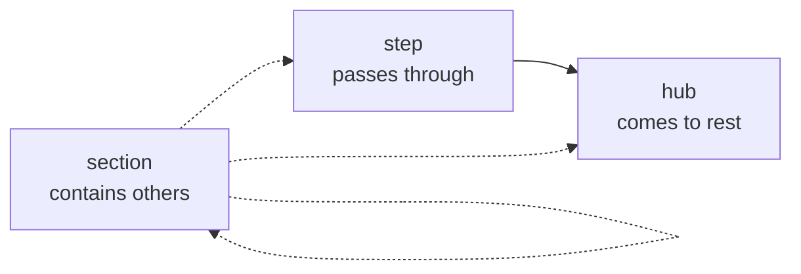

# Authoring guide

How to write a Leyline workflow: what belongs in the document, what belongs in
the capability bundle, and what belongs in neither.

Every term used here is defined once in the
[glossary](../glossary.md) — [node](../glossary.md#node),
[surface](../glossary.md#surface), [guard](../glossary.md#guard),
[section](../glossary.md#section), [context](../glossary.md#context).

## The one question to keep asking

> Is this a fact about **what the workflow is**, or about **how it looks**?

Facts about what it is go in the document: which step comes next, what must
finish first, which action exists only on a paid tier, what the page is composed
of. Facts about how it looks go in a renderer, and Leyline never learns them.
That line is the whole design (brief §4). A schema that can say `width: 240px`
has become a worse HTML.

The line is sharper than it first looks. "The sidebar sits on the left" is
appearance. "The sidebar is one of the three things this page holds, and it is
first in reading order" is structure — and it is enough for a renderer to put it
on the left, on the right, or in a drawer on a phone.

## Three node kinds



A **step** is somewhere a user passes through: it does work, or takes input, and
then moves on. A **hub** is somewhere they come to rest and choose. A **section**
contains other nodes and says how they run together.

A section is the same construct at every scale — a full page, a panel, an input
box with its own idle, editing, and validating states. What differs is which
renderer claims it, not what the schema says
([decision 0019](../decisions/0019-section-nodes.md)).

Sections have a **mode**. `one` keeps exactly one child active, which is a
wizard or a set of tabs. `many` keeps every child active and advancing on its
own, which is a page whose sidebar, main panel, and activity feed each hold
their own state.

Children are named, not nested:

```jsonc
{
  "id": "workspace-page",
  "kind": "section",
  "mode": "many",
  "children": ["navigation", "workspace-hub", "activity"],
}
```

The `nodes` array stays flat and a transition target stays a plain identifier
with no path syntax — which is both easier to read and the reason
[identifiers can stay opaque](../../SECURITY.md) (I5).

## Surfaces say what, never how

A surface is a piece of UI intent on a node:

```jsonc
{
  "id": "actions",
  "type": "datatable",
  "description": "Everything the user can do with this workspace",
  "dataSource": "workspaceActions",
  "when": "isPaidTier",
}
```

Five types ship in v1 — `form`, `datatable`, `metric-panel`, `link`, `text` —
and nothing beyond what the reference scenario needs
([decision 0016](../decisions/0016-minimum-surface-set.md)). An unknown type is a
**warning**, never an error, so a document written against a later version still
runs on an older build (AD8).

Write the `description`. It is not a comment: it is what an agent reads when
deciding whether this is the surface it was asked to change, and what a devtools
panel shows. "Everything the user can do with this workspace" is useful;
"actions table" is the identifier again.

`when` names a guard. The surface disappears from the snapshot when the guard is
false, so a renderer never receives something it is supposed to hide, and no
component grows an `isPaidTier &&`.

## Capabilities are names

Guards, services, and data sources appear in the document as strings, declared
up front in the **requirements block**:

```jsonc
"requires": {
  "guards": ["isPaidTier", "needsBilling"],
  "services": ["createWorkspace", "submitBilling"],
  "dataSources": ["workspaceActions", "workspaceMetrics"]
}
```

The implementations live in a **capability bundle** the application hands to
`createWorkflow`, and binding fails loudly if anything is missing — naming every
gap at once rather than the first one.

This is what makes the document serializable, the logic unit-testable without a
workflow, and an agent-authored document unable to smuggle in code (I1, I2).

The requirements block is also a closed set: a document may only reference what
it declared, and the DSL checks that at compile time.

## Two ways to write one

### The TypeScript DSL

```ts
import { defineWorkflow } from '@leyline/dsl';

export const onboarding = defineWorkflow({
  id: 'workspace-onboarding',
  name: 'Workspace onboarding',
  entry: 'create-workspace',

  context: {
    workspace: { type: 'object', optional: true },
    tier: { type: 'string' },
  },
  requires: {
    guards: ['needsBilling'],
    services: ['createWorkspace', 'submitBilling'],
    dataSources: ['workspaceActions'],
  },

  nodes: {
    'create-workspace': {
      kind: 'step',
      invoke: {
        service: 'createWorkspace',
        assignTo: 'workspace',
        onDone: [{ target: 'billing', when: 'needsBilling' }, { target: 'workspace-hub' }],
      },
    },
    billing: {
      kind: 'step',
      invoke: { service: 'submitBilling', onDone: [{ target: 'workspace-hub' }] },
    },
    'workspace-hub': {
      kind: 'hub',
      surfaces: [{ id: 'actions', type: 'datatable', dataSource: 'workspaceActions' }],
    },
  },
});
```

Nodes are keyed by identifier, so the identifier is written once and every
reference is checked against those keys. A typo in a `target`, a guard that is
not in `requires`, a context field that does not exist — all type errors, landing
on the offending property rather than on the call.

### Hand-written JSON

Equally valid. The DSL is a producer, not a second source of truth (AD1), and
the test that gates it asserts its output is byte-identical to the hand-written
fixture.

Validate directly:

```ts
import { validateWorkflow } from '@leyline/schema';

const result = validateWorkflow(JSON.parse(source));
for (const issue of result.issues) {
  console.error(`${issue.severity} ${issue.rule} at ${issue.path}: ${issue.message}`);
}
```

Producers in other languages validate against the
[published JSON Schema](../../packages/schema/schema/), which carries the real
constraints — identifier and version rules travel as `pattern`, so a Kotlin or
Python producer is held to the same rule this build enforces.

## What the types cannot catch

Anything that is a property of the whole graph. `defineWorkflow` validates before
returning and throws `WorkflowDefinitionError` carrying the same structured
issues validation always produces, so these fail at module load rather than in
front of a user:

| Rule                          | What it caught                                       |
| ----------------------------- | ---------------------------------------------------- |
| `graph.unreachable-node`      | A node no path arrives at                            |
| `graph.dangling-target`       | A transition to a node that does not exist           |
| `graph.cross-boundary-target` | A transition landing _inside_ a section it is not in |
| `graph.containment-cycle`     | A section containing itself                          |
| `graph.multiple-parents`      | A node claimed by two sections                       |
| `graph.entry-not-root`        | An entry node sitting inside a section               |
| `section.missing-initial`     | A `one` section that never says which child starts   |
| `surface.missing-target`      | A `link` with nowhere to go                          |
| `capability.undeclared`       | A name the requirements block does not list          |

The full catalogue is in the
[`@leyline/schema` README](../../packages/schema/README.md#validation).

**Cross-boundary targets** are the rule that surprises people. A transition may
reach a root node, a sibling, or an ancestor — but not a node nested inside a
section it does not belong to. Entering a container means entering it at the top,
and the error suggests the section itself. This is the one place the design
chooses legibility over configurability, deliberately.

## Identifiers

Write them where they matter and leave them out where they do not. An identifier
you omit is **derived** — by hashing what the thing is, never where it sits and
never what guard it carries
([decision 0018](../decisions/0018-identifier-derivation.md)).

That last part is what makes an identifier worth addressing: attaching a guard to
a surface leaves its identifier untouched, so an agent that named it on Monday
can name it on Tuesday.

Write one when something is a long-lived address — anything a renderer
registration, a personalization, or an agent will refer to. Omit it for a
`text` surface nobody will ever point at.

## Testing a workflow

The document is data, so drive it headlessly with no DOM and no framework:

```ts
import { createWorkflow } from '@leyline/core';

const workflow = createWorkflow(onboarding, bundle, {
  mode: 'development',
  initialContext: { tier: 'free' },
});

workflow.send({ type: 'CREATE' });
await settle();

expect(workflow.getSnapshot().root.id).toBe('workspace-hub');
```

Three things are worth asserting, and they are the things components used to
hide:

- **Sequencing** — a service finished before the next node became active.
- **Eligibility** — a surface is absent for a free tier and present for a paid
  one. Assert on the snapshot, not on rendered output.
- **Topology** — the path a completed step actually takes, including the guarded
  fork.

The trace stream is the fourth: `workflow.trace.recent()` is the ordered record
of what happened, and it is usually a faster way to see why a test failed than
inspecting the final snapshot.

## Writing to disk

```ts
import { serializeWorkflow } from '@leyline/schema';

writeFileSync('onboarding.json', serializeWorkflow(onboarding));
```

**Canonical form is the authored document**, not a normalized expansion of it —
identifiers left out stay left out, because a derived identifier is derived
([decision 0032](../decisions/0032-canonical-form.md)). A DSL-authored document
and a hand-written one for the same workflow are byte-identical, which is what
lets the fixture corpus coordinate two authoring languages.

## Where to go next

- [Agent integration](agents.md) — letting an agent operate what you just wrote
- [Migration](migration.md) — adopting Leyline into an application that already
  exists, and moving documents across versions
- [`examples/react-workspace`](../../examples/react-workspace) — this scenario as
  a running application
