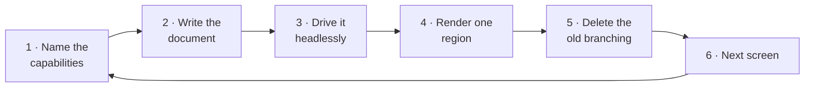
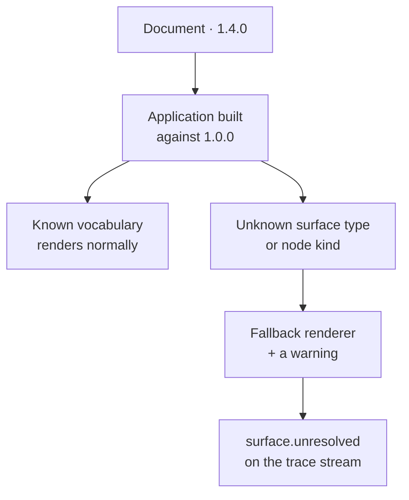

# Migration guide

Two different things get called migration, and they have almost nothing in
common:

1. **Adopting Leyline** in an application that already exists and already works.
2. **Moving a document** across a schema version.

The first is most of the work and all of the risk. The second is deliberately
almost nothing, and the rest of this page explains why.

Vocabulary is in the [glossary](../glossary.md) —
[schema version](../glossary.md#schema-version),
[additive evolution](../glossary.md#additive-evolution),
[fallback renderer](../glossary.md#fallback-renderer),
[surface](../glossary.md#surface).

---

## Part 1 — Adopting Leyline

### Do not start with the workflow

The instinct is to model the whole flow first. It is the wrong order, because the
value you are after is not "we have a document" — it is "this knowledge is no
longer trapped in a component", and you learn whether that is true only by
running it.

Start with **one screen that already hurts**. Good candidates have a shape you
will recognise:

- A component with a `useEffect` that decides what to do next.
- A page where three booleans from three sources decide what renders.
- A flow whose order is documented in a comment, or nowhere.
- Anything a product manager has asked to reorder twice.

### The incremental path



**1 · Name the capabilities before you write the document.** Pull the predicates
and the async calls out of the component into plain functions. They become the
capability bundle. This step alone is usually worth doing: those functions become
unit-testable without a DOM, and you will discover that two of your booleans were
the same guard under different names.

```ts
export const bundle = {
  guards: {
    isPaidTier: (ctx) => ctx.tier === 'paid' || ctx.tier === 'organization',
  },
  services: {
    createWorkspace: async (input) => api.workspaces.create(input),
  },
  dataSources: {
    workspaceActions: () => store.actions,
  },
};
```

**2 · Write the document** against those names. See the
[authoring guide](authoring.md).

**3 · Drive it headlessly** before it renders anything. This is the step people
skip and then regret:

```ts
const workflow = createWorkflow(document, bundle, {
  mode: 'development',
  initialContext: { tier: 'free' },
});
workflow.send({ type: 'CREATE' });
await settle();
expect(workflow.getSnapshot().root.id).toBe('workspace-hub');
```

If the sequencing is wrong, you want to find out here, not through a rendered
page. And these tests are the ones you never had: assertions about order and
eligibility that previously required mounting a component.

**4 · Render one region.** Mount `WorkflowView` inside the screen you already
have, rather than replacing the screen. Your existing layout stays; one region of
it starts coming from the document.

```tsx
<ExistingPageChrome>
  <WorkflowView workflow={workflow} />
</ExistingPageChrome>
```

Register renderers that wrap the components you already have. A renderer is
usually a five-line adapter around an existing component, not a rewrite:

```tsx
const ActionsTable: SurfaceRenderer = ({ surface }) => (
  <LegacyActionsTable rows={surface.data as Action[]} />
);
```

**5 · Delete the old branching.** This is the point of the exercise and the step
that proves it worked. If the `if (tier === 'paid')` in the component is still
needed, the guard is not doing its job — find out why before moving on. A surface
whose guard is false is absent from the snapshot entirely, so the component never
receives it and never has to hide it.

**6 · Next screen.** The second one is much faster, because the capability bundle
and the renderer catalogue already exist.

### What not to move

Some knowledge genuinely belongs in components, and moving it into the document
makes both worse:

| Stays in the component          | Because                                                                         |
| ------------------------------- | ------------------------------------------------------------------------------- |
| Layout, spacing, breakpoints    | A schema that can say `width` has failed (brief §4)                             |
| Animation and transition timing | Same                                                                            |
| Field-level input formatting    | Presentation of a value, not a fact about flow                                  |
| Which of two icons to draw      | Appearance                                                                      |
| Local UI state (a menu is open) | Not workflow state; it survives nothing and means nothing outside the component |

The test is the question from the authoring guide: is this a fact about what the
workflow **is**, or about how it **looks**?

### Running alongside a router

Leyline describes topology; it does not own the URL. The two compose in one
direction — the workflow publishes where it is, and the router reflects that:

```ts
workflow.subscribe(() => {
  const { root } = workflow.getSnapshot();
  if (root.id !== currentRouteNode) router.replace(routeFor(root.id));
});
```

Going the other way — letting the URL drive the workflow — means sending an event,
not setting a position. A deep link is an event the workflow either accepts from
where it is or does not.

### Mixing with existing state management

Leyline's context holds the declared fields the workflow branches on. It is not a
replacement for your store, and trying to make it one will hurt.

A good split: **your store holds data; the workflow's context holds what the
workflow branches on.** `tier` belongs in context because a guard reads it. The
full user object does not.

`context.patch` is the control-plane change that writes declared fields, so the
boundary is enforceable rather than a convention.

---

## Part 2 — Moving a document across versions

### Within a major version, there is nothing to do

Evolution within a major version is additive, and that is a contract rather than
an intention (AD8):

- New optional fields may appear.
- New node kinds and surface types may appear.
- **No field changes meaning, changes type, or disappears.**
- **No field becomes required that was optional.**

So a document written against 1.0.0 parses unchanged against 1.4.0. Nothing to
migrate, nothing to run.

### The version-skew direction that matters

The interesting case is the other one: a **deployed application reading a document
written against a later minor version**. This happens the moment documents are
stored, generated, or shipped separately from the build that renders them, which
is to say immediately.

Leyline handles it by degrading rather than failing:



An unknown surface type is a **warning**, not an error
([decision 0017](../decisions/0017-structure-errors-vocabulary-warnings.md)). The
document still validates, the document still runs, and the parts the build
understands work. The unknown part draws the fallback renderer and reports
`surface.unresolved`.

This is the version-skew problem that server-driven UI practice solved this way,
and it is why the rule is worth the constraint it puts on the schema.

Two things follow for an application:

- **Keep a fallback registered.** `FALLBACK_RENDERERS` ships with each adapter;
  registering one claiming `*` at rank 0 replaces the built-in placeholder with
  something that matches your design.
- **Watch `vocabulary.unknown-surface-type` warnings** in whatever you do with
  validation output. They are your signal that documents have moved ahead of a
  deployed build — useful information, not an error.

### Across a major version

A major bump means a document written for the old version no longer parses. It
arrives with a documented reason and a migration path, never as a side effect of
a refactor.

`isSupportedSchemaVersion` is the check, and `SUPPORTED_MAJOR_VERSIONS` is what it
reads. A build refuses a major it does not list rather than guessing.

There is no v1→v2 migration to describe yet. When there is, it will live here.

### Package versions are a different number

The `@khorum-oss/leyline-*` packages version together through Changesets and follow semver
against the TypeScript API. A schema document version bump does not force a
package major, and a package major does not imply a document version change —
they answer different questions. See [versioning](../versioning.md).

---

## Migrating away

Worth saying, because a layer you cannot leave is a layer you should not adopt.

The document is JSON you already have. The capability bundle is plain functions
with no Leyline types in their signatures. The renderers are your components with
a thin adapter. What you would lose by removing Leyline is the interpreter, the
control plane, and the trace stream — and what you would have to write back into
components is the branching you deleted in step 5.

That is a real cost, and it is the same cost as adopting any runtime. It is not a
data-format lock-in, which is the kind that actually traps people.

## Where to go next

- [Authoring](authoring.md) — writing the document
- [Agent integration](agents.md) — opening it up to agents, safely
- [Versioning](../versioning.md) — the policy in full
