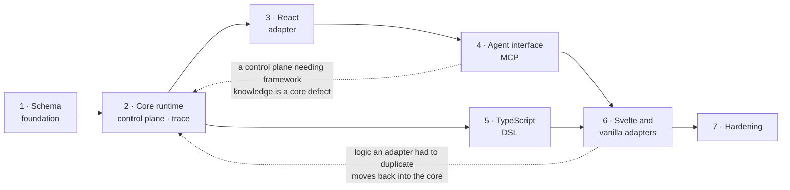

# Delivery sequence

Each stage produces a working, tested artifact. Two orderings carry weight and
resist rearranging: stage 4 lands before the second and third adapters, so that
a control plane needing framework knowledge shows up as a core defect early; and
stage 6 lands within v1, because two more adapters are the only honest test of
whether the core stayed headless.

Stage scopes use the project vocabulary throughout; [`glossary.md`](glossary.md)
defines it.

| Stage | Scope                                                                                                                                                                                                                                                                                                                   | Exit criteria                                                                                                                                                      |
| ----- | ----------------------------------------------------------------------------------------------------------------------------------------------------------------------------------------------------------------------------------------------------------------------------------------------------------------------- | ------------------------------------------------------------------------------------------------------------------------------------------------------------------ |
| 1     | **Schema foundation** — Zod definitions for the minimal node and surface set, graph validation (dangling targets, unreachable nodes, undeclared capabilities), stable identifier rules, JSON Schema export, change-description schemas                                                                                  | The §2 workflow round-trips as a JSON document; graph validation rejects each malformed case by name; JSON Schema exports and validates the same corpus            |
| 2     | **Core runtime, control plane, trace stream** — interpreter over the XState facade, store, capability binding and verification, control-plane-addressable registries, trace emitter with ring-buffer and console sinks, change log projected from the stream, propose/validate/apply/revert, policy and redaction hooks | §2 items 1–5 drive headlessly with no DOM; every AD14 invariant has a suite that tries to break it; replaying a trace stream reconstructs the identical change log |
| 3     | **React adapter** — reactivity bridge, ranked renderer registry, `WorkflowView`                                                                                                                                                                                                                                         | §2 items 1–5 run end to end in a React application; the adapter holds no workflow logic                                                                            |
| 4     | **Agent interface** — introspection, operation descriptors, MCP adapter                                                                                                                                                                                                                                                 | §2 items 6–7 run end to end with a real agent driving the React application through MCP, with no access to application source                                      |
| 5     | **TypeScript DSL** — builder emitting validated schema with compile-time node reference checking                                                                                                                                                                                                                        | The §2 workflow authored through the DSL emits a document byte-identical to the hand-written one                                                                   |
| 6     | **Svelte and vanilla adapters**                                                                                                                                                                                                                                                                                         | §2 items 6–7 re-run against the SvelteKit application with no change to `@leyline/agent`; anything an adapter had to duplicate has moved into the core             |
| 7     | **Hardening** — finalized threat model, observation-cost benchmarks, versioning policy, authoring guide, agent integration guide, migration guidance. The devtools inspector and the OpenTelemetry sink moved to post-v1 (see below)                                                                                    | Benchmarks show unobserved tracing within noise; `SECURITY.md` matches the shipped invariant suites                                                                |

## Stage order

Two orderings resist rearranging, and the graph shows why: stage 4 sits on the
critical path _before_ the second and third adapters, and stage 6 sits inside
v1 rather than after it.

The dotted edges are the feedback each stage is designed to produce. Finding
either one late costs a redesign; finding it on schedule costs a refactor.

## Current position

**Stage 7 complete. v1 is done.** Seven stages, each with a working tested
artifact, and both orderings the sequence was built around paid out: stage 4
landed before the second and third adapters and found nothing wrong with the
control plane, and stage 6 found the duplication it was placed to find.

What stage 7 settled:

- **The threat model matches what ships.** Each of I1–I7 names the suites behind
  it, and [`tests/security.test.ts`](../tests/security.test.ts) fails if the
  document and the suites disagree in either direction — or if the required CI
  gate stops running a package that holds one. The gate had in fact gone narrow:
  invariant suites in `@leyline/agent` and `@leyline/dsl` sat outside its project
  filter, so they had quietly stopped counting as a gate.
- **The cost of tracing has a number and a test.**
  [`performance.md`](performance.md) records both. An unobserved `emit` runs
  within 13% of the bare boolean check it performs, and the property that makes
  that true is held by tests rather than by the benchmark. Writing them found a
  defect: the engine flattened the active tree twice on every published snapshot
  to describe a transition that, unobserved, was then discarded.
- **The guides.** [Authoring](guides/authoring.md),
  [agent integration](guides/agents.md), and [migration](guides/migration.md) —
  the last covering both senses of the word: adopting Leyline into an application
  that already exists, and moving documents across versions.
- **The documentation stopped drifting.** The decision index listed three of
  eighteen records, and the open-questions page claimed eight closures above a
  table reading as though six were still open. Both are now checked by
  [`tests/decisions.test.ts`](../tests/decisions.test.ts) — the same answer the
  glossary got: a document that has to stay true gets a test that says so.

**Post-v1**, in the order the project has already asked for them:
`@leyline/devtools`, an inspector over the trace stream and the change log, and
`@leyline/otel`, a sink bridging to OpenTelemetry. The delivery table above
listed both under stage 7 while brief §6 places them after v1; the contradiction
had to resolve somewhere, and it resolved here.

Then the Kotlin authoring track described in brief §10, which coordinates through
the exported JSON Schema and a shared fixture corpus — the same equivalence the
TypeScript DSL is already held to.
