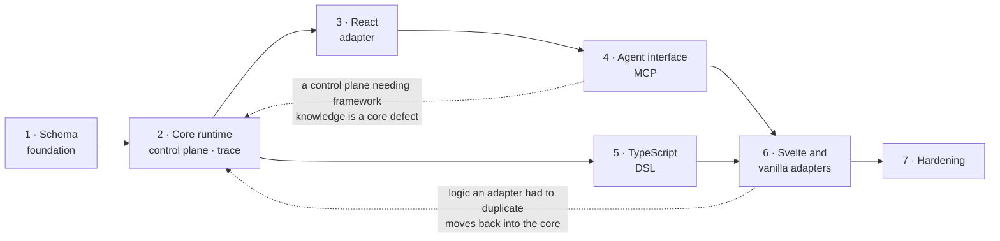

# Delivery sequence

Each stage produces a working, tested artifact. Two orderings carry weight and
resist rearranging: stage 4 lands before the second and third adapters, so that
a control plane needing framework knowledge shows up as a core defect early; and
stage 6 lands within v1, because two more adapters are the only honest test of
whether the core stayed headless.

Stage scopes use the project vocabulary throughout; [`glossary.md`](glossary.md)
defines it.

| Stage | Scope                                                                                                                                                                                                                                                                                                                   | Exit criteria                                                                                                                                                      |
| ----- | ----------------------------------------------------------------------------------------------------------------------------------------------------------------------------------------------------------------------------------------------------------------------------------------------------------------------- | ------------------------------------------------------------------------------------------------------------------------------------------------------------------ |
| 1     | **Schema foundation** — Zod definitions for the minimal node and surface set, graph validation (dangling targets, unreachable nodes, undeclared capabilities), stable identifier rules, JSON Schema export, change-description schemas                                                                                  | The §2 workflow round-trips as a JSON document; graph validation rejects each malformed case by name; JSON Schema exports and validates the same corpus            |
| 2     | **Core runtime, control plane, trace stream** — interpreter over the XState facade, store, capability binding and verification, control-plane-addressable registries, trace emitter with ring-buffer and console sinks, change log projected from the stream, propose/validate/apply/revert, policy and redaction hooks | §2 items 1–5 drive headlessly with no DOM; every AD14 invariant has a suite that tries to break it; replaying a trace stream reconstructs the identical change log |
| 3     | **React adapter** — reactivity bridge, ranked renderer registry, `WorkflowView`                                                                                                                                                                                                                                         | §2 items 1–5 run end to end in a React application; the adapter holds no workflow logic                                                                            |
| 4     | **Agent interface** — introspection, operation descriptors, MCP adapter                                                                                                                                                                                                                                                 | §2 items 6–7 run end to end with a real agent driving the React application through MCP, with no access to application source                                      |
| 5     | **TypeScript DSL** — builder emitting validated schema with compile-time node reference checking                                                                                                                                                                                                                        | The §2 workflow authored through the DSL emits a document byte-identical to the hand-written one                                                                   |
| 6     | **Svelte and vanilla adapters**                                                                                                                                                                                                                                                                                         | §2 items 6–7 re-run against the SvelteKit application with no change to `@leyline/agent`; anything an adapter had to duplicate has moved into the core             |
| 7     | **Hardening** — devtools inspector, OpenTelemetry sink, finalized threat model, versioning policy, authoring guide, agent integration guide, migration guidance                                                                                                                                                         | Benchmarks show unobserved tracing within noise; `SECURITY.md` matches the shipped invariant suites                                                                |

## Stage order

Two orderings resist rearranging, and the graph shows why: stage 4 sits on the
critical path _before_ the second and third adapters, and stage 6 sits inside
v1 rather than after it.

The dotted edges are the feedback each stage is designed to produce. Finding
either one late costs a redesign; finding it on schedule costs a refactor.

## Current position

**Stage 1 complete.** The canonical document is defined in Zod and exported as
JSON Schema; graph and capability validation reject each malformed case by name;
deterministic addressing, change descriptions, and the trace envelope are in
place. The reference workflow from brief §2 round-trips byte for byte and
validates identically under the TypeScript validator and under Ajv reading the
published artifact.

Section nodes arrived after the fact, on the strength of a requirement the brief
did not anticipate: containers that hold other containers, and end users
rearranging their own view. Taking it before stage 2 cost three optional fields
and a validation pass; taking it after would have meant reshaping the snapshot
every adapter reads. See [0019](decisions/0019-section-nodes.md) and
[0020](decisions/0020-personalization.md).

Decisions recorded along the way: [0016](decisions/0016-minimum-surface-set.md)
(the surface set, closing OQ5), [0017](decisions/0017-structure-errors-vocabulary-warnings.md)
(severity policy), [0018](decisions/0018-identifier-derivation.md) (what a
derived identifier hashes), [0019](decisions/0019-section-nodes.md) (section
containment) and [0020](decisions/0020-personalization.md) (personalization as
control-plane traffic).

Stage 2 — the core runtime, control plane, and trace stream — starts next. The
contracts it implements and the change vocabulary it accepts already exist, so
the work is behaviour rather than shape.

Post-v1: `@leyline/devtools` and `@leyline/otel`, plus the Kotlin authoring
track described in brief §10, which coordinates through the exported JSON Schema
and a shared fixture corpus.
